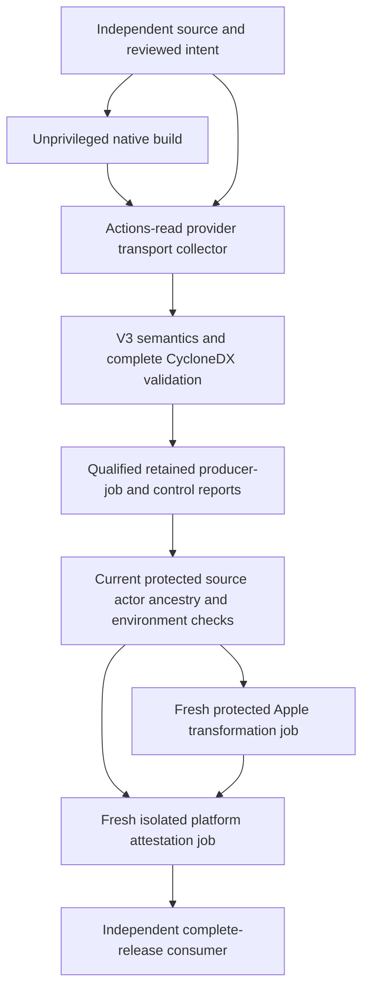

# ADR 0001: Authenticate provider storage before privileged finalization

## Status

Proposed for human review. The bounded provider collector is implemented; the
protected finalizer, platform-report adapter and credential boundary are pending.
This ADR does not claim ticket #9 acceptance or SLSA Build L2 achievement.

## Context

The v3 unsigned builder emits five exact leaves and binds inventory bytes to
source, workflow, selection, run and attempt. Its reader verifies consistency.
An attacker can still rewrite an unsigned envelope and its hashes. A finalizer
needs independently authenticated transport and independently established intent
before considering those claims or obtaining signing credentials.

GitHub's artifact REST records contain the ZIP digest and producing run/source,
but no run-attempt field. The current attempt, explicit attempt endpoint, upload
name and provider upload window must all agree. A rerun or artifact replacement
can occur while a job downloads files, so initial observations need rereads.
Successful storage authentication does not identify the uploading job, attest
Cargo execution or prove that a hosted job enforced required controls.

OIDC permissions make token-request credentials available to the job. Validating
an artifact as the first step of an `id-token: write` job therefore does not
establish authentication before credential availability. Apple environment
secrets likewise require a preceding unprivileged job and effective protection
in the caller repository.

The required scope is GitHub.com, three supported native hosts, fixed trusted
helpers and bounded library/CLI/service handoffs. No caller shell, custom
provenance, arbitrary endpoint, tool pin or signing subject enters this adapter.
Credential values must never be requested from the owner, exported or logged.

## Decision

Use the already qualified native GitHub CLI 2.102.0 at exact executable byte pins
to perform fixed GitHub.com GET requests. Match independent repository ID/name,
head and checkout commits, caller workflow path/ID, trigger, reusable builder
commit, run/attempt and the complete independently derived artifact set. Check
the current and explicit attempt, upload window and freshness before downloading.
Require the provider's exact ZIP SHA-256 and size before reading members. Reread
the current attempt and complete artifact set after download, then yield private
read-only inert leaves for separate semantic validation.

This result is a provider transport observation. It never grants a credential
permit. Its receipt explicitly records `signing_authorized: false`,
`producer_job_authenticated: false` and
`cryptographic_release_authenticated: false`. A JSON receipt is an audit record,
not a private trust proof and not an input from which a finalizer may reconstruct
authorization.

The future controller must own this complete sequence at one immutable workflow
commit, using fresh jobs and fixed commands:

The transport job receives only its ephemeral actions-read token and contents
read as needed for trusted source. It has no Apple secrets, OIDC, attestation or
publication permissions and executes no consuming Cargo/build scripts or
downloaded payloads. Finalizer jobs depend on its successful validated output
and must rehash their exact local inputs and recheck mutable prerequisites.
Qualified platform reports and effective caller environment protections remain
mandatory; neither a successful `needs` dependency nor a signed tenant assertion
alone satisfies those gates. An administrator/human must establish effective
protected environments; this implementation creates none.

PR observations are permitted for unprivileged transport qualification only.
The future credential gate must reject PR/fork, `pull_request_target`,
`workflow_run`, branch/tag confusion and unapproved dispatch/source/actors.
For PR qualification, the independently established checkout merge differs
from REST `head_sha`; its merge parents/tree must be independently checked before
constructing intent. For push/dispatch observations the collector already
requires checkout commit to equal provider head. Ref protection, actor and
ancestry authentication belong to the required later gate, not this receipt.

## Resource and operational constraints

The collector admits at most 64 selections and one complete artifact page.
Missing/paginated/extra/duplicate sets fail; it never silently truncates. Each
JSON response is at most 4 MiB. Native reads have a 60-second wall-clock deadline,
bounded streaming stdout and 1 MiB discarded stderr. The stage checks its
20-minute monotonic deadline before reads and before yielding. Each transport
ZIP is at most 1,152 MiB. The five leaves retain v3's 1 GiB artifact, 16 MiB each
SBOM/graph/inventory and 1 MiB envelope limits.

Check ZIP end-directory count/size before constructing an unbounded member list.
Only five exact regular safe leaves and stored/deflated compression are accepted;
encryption, directories, links, devices, nested paths, duplicates, ZIP64 and
trailing ZIP comments/bytes fail. Never unpack a nested `.crate` or execute a
`.bin`. Stage private files at mode 0400 and delete them when the collection
context ends. Sixty-four maximum-size selections can require roughly 140 GiB of
temporary disk for retained ZIPs plus leaves; insufficient disk fails the entire
request. Native filesystem reads/decompression are bounded by bytes but are not
individually interrupted by the stage clock. Stable filesystem ancestry and no
hostile process with the same OS account are required, as with existing readers.

In workflow mode, an isolated HOME/config/cache and fixed environment omit
ambient tokens, proxies, debug, startup hooks and caller tool variables. Only
the explicitly provided ephemeral token is forwarded to native gh. The separate
operator constructor delegates to the existing workstation gh credential store
for authorized read-only qualification and reports that different mode. It does
not read/export a credential value or qualify workflow-token isolation.

Provider outage, permission denial, unknown/missing digest, stale attempt,
unsupported archive or native pin mismatch blocks the collector. There is no
anonymous fallback, compatibility downgrade, mutation, publication or tag API.
Same-account tool substitution after pin checking remains outside the snapshot
isolation model. Tool executable pins are actual native member bytes, not the
distribution archive digest.

The factory still needs a reviewed versioned runtime/catalog migration that
distinguishes a common runtime distribution from platform executable members.
Frozen v1 `InputIdentity.runtime` and `CatalogPin.distribution` identities must
not be silently reinterpreted or filled with a hash string masquerading as bytes.
All build/package/signing workflow identities must satisfy the independently
approved contract; code and caller pin updates need the demonstrated two-phase
handoff used by the v3 rehearsal.

## Alternatives considered

* A first verification step in the credentialed job: rejected because credentials
  are already available, even when later steps are conditionally skipped.
* A plain envelope/name or upload output as authority: rejected because neither
  authenticates provider storage, exact source or the current attempt.
* A generic artifact-download action with caller-supplied URLs/IDs: rejected
  because it cannot express the complete independent storage and byte contract.
* A new HTTP/Snappy/TLS client: deferred; the qualified native gh already handles
  GitHub's storage redirects and authentication without a new credential parser.
* Treating the provider receipt as producer provenance: rejected because the
  artifact API does not authenticate the job or required control semantics.

## Consequences

The same bounded collector can support unprivileged rehearsals and later
finalization without executing build payloads. Exact rereads reject observed
rerun/replacement races, but cannot make provider storage and later signing an
atomic transaction. A future job must authenticate and rehash its own input.
Strict ZIP assumptions can reject future GitHub transport formats; support must
be explicitly qualified and versioned. Maintaining three native gh pins and
fresh provider availability has operational cost. Human review/acceptance,
effective credential isolation, platform semantics and an own signed complete
rehearsal remain separate required outcomes.

## References

* [GitHub artifact API](https://docs.github.com/en/rest/actions/artifacts?apiVersion=2022-11-28)
* [GitHub workflow-run attempts](https://docs.github.com/en/rest/actions/workflow-runs?apiVersion=2022-11-28#get-a-workflow-run-attempt)
* [GitHub OIDC reference](https://docs.github.com/en/actions/reference/security/oidc)
* [Qualified gh source](https://github.com/cli/cli/tree/fc4b137cdef0a6bd28fd461b7cf9c84a5812a8cd)
* [Unsigned handoff v3](../unsigned-handoff-v3.md)
* [Collector usage and qualification](../provider-transport-v1.md)
