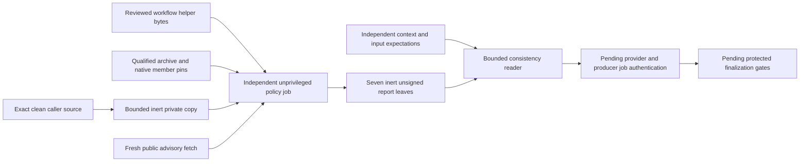

# ADR 0002: Retain independent unprivileged policy observations

Status: proposed for human acceptance. Implementation/native validation and catalog
approval are separate gates. SLSA Build L2 remains the v0.1 target; Level 3 is deferred.

The existing CI job checks policy before executing consuming build/test code in the
same job and retains no native reports. A credentialed finalizer needs evidence whose
inputs and tool bytes can be independently established without exposing credentials
to consuming execution. The frozen five-leaf unsigned builder handoff does not provide
that contract. Reports cannot authenticate their own producer.

Add an explicit `rust-policy-v1.yml` successor job with only read permissions, fixed
trusted helpers, exact native tool archive/member pins and inert bounded snapshots.
Keep existing CI/build/transport contracts unchanged. Retain successful native reports,
all source file identities, project policy and actual fetched advisory file bytes.
Provide a consistency reader requiring independent context/catalog/input expectations.
Leave signing, producer-job authentication and cryptographic release authentication
false. Protected finalization must establish those separate gates later.

Alternatives considered: retaining ordinary CI logs is cheaper but does not bind
native report semantics and leaves consuming execution in the producer job. Adding
reports to the existing builder version changes a reviewed compatibility boundary
and gives untrusted build code access to report state. Merely storing database commit
names is smaller but omits the actual data inspected. A separate versioned job costs
additional compiler setup, native downloads and advisory fetches, while preserving
old callers and making the credential boundary reviewable.

Nonfunctional requirements: native coverage on all three supported hosts; finite
source/file/archive/output limits; static non-secret failure messages; process-group
deadlines; no consuming builds/scripts; immutable caller/runtime pins; exact run/attempt
and selection binding; source/database rechecks; no stale or weaker fallback. Large,
dirty or symlink-containing repositories fail explicitly. Rust 1.95.0 is qualified;
other compiler/target combinations remain unsupported by this adapter.

Operational costs include one new matrix job per selection and repeated fresh database
fetches. Observations expire after one hour and provider retention is 14 days; recovery
requires a new whole passing attempt. Failed scanner diagnostics are discarded. Database
file bytes are inert base64 JSON, avoiding filesystem extraction. Public provider records
and native header checks do not prove upstream signatures or code safety. Runtime/catalog
approval and provider/producer authentication remain mandatory independent trust inputs.

Failure modes: altered source/tools/policy/reports, malformed or partial summaries,
stale/future observations, database outages or mutations, unsafe entries and cross-run
substitution all reject. Provider races and protected credential/publication gates remain
in later components; this ADR does not grant signing authority or close those criteria.
