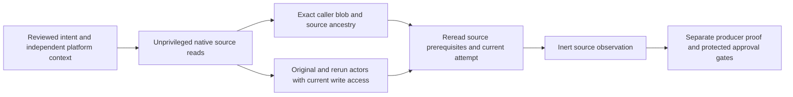

# ADR 0003: Authenticate source control before considering release credentials

Status: proposed for human review. Native qualification is development evidence,
not approval of a production controller, catalog or credentialed environment.
The v0.1 target remains SLSA Build L2; this slice does not establish it.

## Context and decision

Artifact/run metadata alone neither proves PR checkout ancestry nor identifies
the writing job. A source boundary also needs the exact caller bytes, immutable
repository/owner and actor IDs, current actor access, current refs and ancestry.
The independently supplied intent must come from reviewed policy and platform
context. It must never be reconstructed from an offered artifact or audit receipt.

Add an explicit `source_transport_v1` successor using the qualified native
GitHub CLI 2.102.0. Preserve all older transport, runtime, catalog and caller
contracts byte for byte. The native adapter admits only fixed GitHub.com GET
routes for repository metadata, run/attempt, commits, trees, blobs, refs, tags,
PRs, collaborator permissions and commit comparisons. It has the same native
byte check before every read, sterile workflow-token environment, bounded pipes,
closed stdin, discarded diagnostics and sixty-second request deadline as v1.
It cannot fetch artifacts, execute caller code or mutate refs/releases/settings.

PR qualification requires an open same-repository non-fork PR, exact current
head/base/ref, exact merge commit and ordered base/head parents. It remains
unprivileged. Release observation supports only a stable `vMAJOR.MINOR.PATCH`
tag push or dispatch on the independently named default branch. Resolve
lightweight/annotated tags with at most eight tag objects and reject cycles or
non-commit leaves. Require the source commit to be the default branch's current
ancestor. Dispatch additionally requires exact current default-head equality.
Branch pushes, moving/prerelease tags and unsafe events remain unsupported.

Walk three exact Git tree entries to the caller; require regular non-executable
mode 100644. This avoids the contents API's documented symlink dereferencing.
Require nontruncated trees with at most 4,096 entries and a caller blob at most
128 KiB. Check canonical base64, exact size, Git blob SHA and the independently
reviewed SHA-256. Both original and triggering actors must match separate exact
IDs/logins and currently have the provider's `write` or `admin` base permission.
Do not infer access from a custom role name. Bots are unsupported in this version.

Read the source prerequisites twice, require identical observations, then recheck
latest/explicit attempt. Freshness is at most one hour and applies at completion.
Provider denial/outage, truncated responses, stale/failed attempts, changed refs,
caller bytes, actors, source or default branch reject without fallback.

## Alternatives and consequences

Job names, logs and artifact-upload outputs were rejected as producer authority:
they do not authenticate the job that wrote an artifact. OIDC/Sigstore producer
proof remains a separate required boundary. An unsigned receipt cannot supply it.
Checking only Git names is cheaper but permits moved refs or altered callers.
Using repository-content URLs is simpler but dereferences some symlinks; explicit
tree/blob inspection costs additional reads and rejects unsafe modes.

Source provider authentication means fixed-origin authenticated storage/context
observations under independent expectations. It is not cryptographic provenance,
source approval, proof of effective ruleset/bypass policy, protected environment,
catalog/root acceptance or continuing credential authorization. Every such flag
remains false. A later controller must own producer/control proofs and separately
authenticate effective protections/approvals immediately before finalization.
Python trusted helper execution and stable same-account filesystem ancestry are
assumptions; caller configuration cannot extend the helper or its route policy.

Two full rereads cost roughly thirty GETs per observation. Four-MiB JSON bounds,
the twenty-minute native stage deadline and strict tree limits can reject large
repositories or provider response changes. The checkpoint is not an atomic
provider transaction; a later job must reauthenticate its own prerequisites.
Default-branch changes, actor renames/revocation and PR updates require a new
matching reviewed intent. No administrator setting changes are implemented.

The hosted helper qualifies this candidate's PR source/caller on all three native
runners with actual read tokens. Its caller digest comes from the development
candidate checkout: it is a qualification expectation, not production review or
catalog acceptance. Separate operator qualification uses existing gh native
authentication without reading/exporting credential values. Neither mode signs,
publishes, obtains OIDC/Apple secrets, builds consuming source or uploads assets.

## References

* [Git refs API](https://docs.github.com/en/rest/git/refs?apiVersion=2022-11-28)
* [Git trees API](https://docs.github.com/en/rest/git/trees?apiVersion=2022-11-28)
* [Contents API symlink semantics](https://docs.github.com/en/rest/repos/contents?apiVersion=2022-11-28)
* [Commit comparison API](https://docs.github.com/en/rest/commits/commits?apiVersion=2022-11-28#compare-two-commits)
* [Collaborator permissions](https://docs.github.com/en/rest/collaborators/collaborators#get-repository-permissions-for-a-user)
* [OIDC job identity](https://docs.github.com/en/actions/concepts/security/openid-connect)
