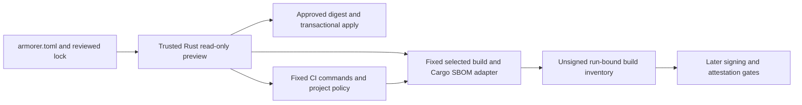

# ADR 0004: Parallel bootstrap, CI and builder contracts

Status: accepted for this implementation sequence; experimental until v0.1.

## Boundaries and ownership

The coordinator owns the frozen interfaces and Git publication. Ticket #4 owns
the Rust apply engine and preview/state schemas. Ticket #6 owns the workflow
repository's common runtime, tool catalog, CI policy and CI workflows. Ticket #7
owns its builder/SBOM adapter, inventory and build workflows. Separate worktrees
and PRs preserve these boundaries. #7's final integration is stacked on #6.

## Apply contract (#4)

Plans bind schema/runtime version, exact config/lock/input preimages, ownership
state and generated bytes. `plan_sha256` hashes canonical typed JSON with the
digest field blank. Apply requires both the plan file and a separately supplied
`--expect-plan-sha256`; strict deserialization and fresh regeneration reject
tampered or stale plans. The initial approved path is `rust-toolchain.toml`.
No caller-provided target paths or arbitrary contents are accepted. Workflow and
policy rendering requires a reviewed catalog and remains a separate integration.

A persistent kernel-locked inode serializes Armorer writes. A durable recovery
journal binds before/after bytes; atomic replacements are staged in destination
directories. Failed writes roll back only matching transaction bytes. Explicit
recovery refuses intervening edits. Replaying an already committed identical
plan is a no-op after validating all receipt and managed-file bindings. Existing
identical files remain unowned; differing unowned files are conflicts. Local
receipts do not assert CI, publication or provenance verification.

## Workflow contract (#6 and #7)

Reusable entry points are `rust-ci.yml` and `rust-build.yml`. They accept no
shell, command, runner, source identity, provenance, subject, digest, tool pin or
matrix claims. Configuration is always the caller checkout's root
`armorer.toml`, validated through the SHA-pinned trusted Rust CLI. The actual
GitHub repository/source/run/attempt comes from the execution context and Git.
Only supported triggers are permitted; pull_request_target is rejected. Builders
operate without OIDC, signing environments, signing secrets, write tokens or
shared output caches. Checkout never persists credentials.

Runtime helpers and tools come from reviewed full commit/digest pins, never the
caller checkout. GitHub.com now supplies `job.workflow_sha` and
`job.workflow_repository` for the reusable job itself; validate the repository
and complete SHA, then checkout that exact helper revision. `github.workflow_sha`
refers to caller context and must not select helpers. Missing job identity
(for example on GitHub Enterprise Server) fails closed. Trusted setup is outside the source checkout's ancestor tree.
Use fixed Python argument arrays with a cleared tool environment. The runtime
rederives each selection from configuration in each job instead of trusting a
caller-supplied matrix. Artifact IDs are deterministic from deliverable ID,
target triple and feature-set name. Supported native runner labels are
ubuntu-24.04, ubuntu-24.04-arm and macos-15. Runner images remain mutable.

### Shared Python API (single owner: #6)

Package: `armorer_runtime` in the workflow repository.

* `common.load_project(root: Path, armorer: Path, expected_repository: str | None
  = None) -> Project` invokes the trusted read-only CLI and validates identity.
* Project exposes `root`, `config`, `plan`, and `selections`. Every selection has
  `id`, `profile`, `package`, `binary`, `target`, `feature_set`,
  `default_features`, `features`, `runner`, `artifact_id`, `toolchain`.
* `common.select(project, artifact_id: str) -> dict` rederives and matches a
  selection; unknown IDs fail closed.
* `common.member_manifest(project, package: str) -> Path` locates exactly one
  selected Cargo member using validated discovery inputs, rejecting ambiguity.
* `common.cargo_environment(toolchain: str, cargo_home: Path,
  target_dir: Path) -> dict[str, str]` constructs an isolated tool environment.
* `tools.install_tools(destination: Path, names: list[str]) -> dict[str, Path]`
  installs only named catalog tools with verified distribution digests, bounded
  safe extraction and no caller URLs. Catalog is versioned in trusted helpers.

Workflow scripts expose only fixed operations. Tests can substitute process
runners explicitly in code; environment variables never introduce release
failpoints or arbitrary commands. Changes to this API require coordinator review.

## Project-specific CI policy

Explicit `.armorer/ci-policy.toml` is separate from repository license-file
presence. Typed policy includes schema version, a nonempty SPDX license
allowlist, source/bans decisions and bounded advisory exceptions with
ID/owner/reason/expiry. Generated cargo-deny configuration lives outside source;
implicit exception files and caller scanner suppression are rejected/disabled.
Existing custom CI and deny policies remain untouched; unsupported/import-needed
policy is reported. No permissive policy is invented for adopters.

Fetch failure, stale RustSec data, expired exceptions and scanner failures fail
CI. Workflow scanners use fixed trusted flags/config; secret reports expose
metadata/counts only. CI cases use declared features, not blanket all-features.

## Target-aware Cargo SBOMs and inventories

cargo-cyclonedx 0.5.9 and CycloneDX JSON 1.5 are pinned. Its CLI does not expose
locked or package-scoped generation, so a trusted adapter supplies locked Cargo
metadata and reconciles the graph to actual selected build compiler-artifact
package IDs/features. Workspace feature-unification fixtures must demonstrate
selection correctness; ambiguity fails closed. Exact expected SBOM filenames
are selected, with duplicate keys/refs, missing roots and dangling edges rejected
before pinned offline schema validation. Zero-dependency libraries are valid.

Inventory version 1 binds the source repository/commit, run/attempt when hosted,
config/Armorer lock/Cargo lock and trusted runtime pins, selection, file names,
sizes and SHA-256 digests, graph scope and explicit native/system coverage gaps.
It contains no caller-provided provenance predicates. `.crate` files are source
packages paired with a target build graph. macOS outputs here are unsigned and
cannot be represented as final signed/notarized bytes. Signing/attestations and
immutable publication are later gates; no SLSA level is claimed by these slices.

## Tradeoffs and failure gates

The Python workflow adapter avoids shipping a new runtime binary release while
the Rust CLI remains the intent validator. The cost is a reviewed, tested shared
adapter contract. Full SHA pins permit rehearsal of unmerged reviewed branches
but must be replaced by accepted catalog pins before adopter release readiness.

Required tests: stale/tampered apply plans, concurrent apply, mid-write and crash
recovery, customization preservation; advisory outages/expiry and suppressed
secret scans; workspace target/feature graph separation, zero-dependency library,
wrong/missing/extra inventory bytes; schema-valid SBOM mutations checked against
the selected Cargo graph; cross-run and artifact-name substitutions checked
against source/run bindings; and unauthorized workflow triggers.

## Primary sources

* [GitHub reusable job source identity](https://docs.github.com/en/actions/reference/workflows-and-actions/contexts#job-context)
* [GitHub reusable workflow context and permissions](https://docs.github.com/en/actions/reference/workflows-and-actions/reusing-workflow-configurations)
* [cargo-cyclonedx 0.5.9](https://docs.rs/crate/cargo-cyclonedx/0.5.9)
* [Cargo compiler-artifact JSON](https://doc.rust-lang.org/cargo/reference/external-tools.html#json-messages)
* [cargo-deny advisory configuration](https://embarkstudios.github.io/cargo-deny/checks/advisories/cfg.html)

Published tool code/help is authoritative where documentation describes newer or
removed flags. Per-lane docs record exact pins and verification evidence.
